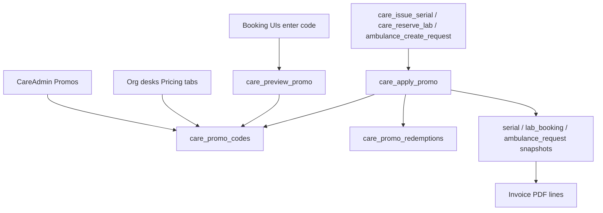

# Care Promo / Voucher Code (Expert) — SAVED PLAN

> **Status:** Deferred — do **not** implement until the user explicitly asks.
> **Saved:** 2026-08-22  
> **Trigger phrase:** e.g. “প্রোমো কোড ইমপ্লিমেন্ট করো” / “implement care promo vouchers”

---

## Overview

একটি unified Care promo/voucher ইঞ্জিন যা সিরিয়াল, ল্যাব ও অ্যাম্বুলেন্স বুকিংয়ে সার্ভার-সাইড প্রয়োগ হবে; প্ল্যাটফর্ম অ্যাডমিন ও অর্গ ডেস্ক দুই স্তরে নিয়ন্ত্রণযোগ্য, ক্যাটালগ ডিস্কাউন্টের পর স্ট্যাক/এক্সক্লুসিভ রুলসহ।

## Scope (fixed defaults)

- **Products:** doctor serial + lab booking + ambulance (Care-এর সব চার্জযোগ্য সার্ভিস)। AI/pharmacy বাদ।
- **Issuers:** প্ল্যাটফর্ম অ্যাডমিন **এবং** Care অর্গ ডেস্ক (দুই স্তর)।
- **Apply order:** ক্যাটালগ/সেকেন্ড-ভিজিট ডিস্কাউন্টের **পর** ভাউচার চালু → payable-এর উপর। কোডে `stackable` ফ্ল্যাগ: `false` হলে ক্যাটালগ % ইগনোর করে লিস্ট থেকে ভাউচার (এক্সক্লুসিভ)।
- **Types:** `percent` | `fixed` (৳)। মিন অর্ডার, ম্যাক্স ছাড় ক্যাপ, তারিখ উইন্ডো, টোটাল/পার-ইউজার লিমিট, প্রোডাক্ট স্কোপ।

## Architecture



**সোর্স অফ ট্রুথ = RPC** (ক্লায়েন্ট শুধু প্রিভিউ)। ক্লায়েন্ট-অনলি ডিস্কাউন্ট নেই।

## Data model (new migration)

**`care_promo_codes`**
- `id`, `code` (unique, uppercase normalized)
- `org_id` NULL = প্ল্যাটফর্ম-ওয়াইড; NOT NULL = সেই অর্গ-অনলি
- `created_by`, `label_bn` / `label_en`
- `discount_type` (`percent`|`fixed`), `discount_value`
- `max_discount_amount` (percent ক্যাপ), `min_order_amount`
- `applies_to` TEXT[] — `{serial,lab,ambulance}` (খালি = সব)
- `stackable` BOOLEAN DEFAULT true
- `starts_at` / `ends_at`, `is_active`
- `max_redemptions` NULL=unlimited, `max_per_user` DEFAULT 1
- `notes` (internal)

**`care_promo_redemptions`**
- `id`, `promo_id`, `user_id` (nullable guest), `org_id`
- `product` (`serial`|`lab`|`ambulance`), `ref_id` (booking/request/serial id)
- `list_amount`, `pre_promo_amount`, `discount_amount`, `final_amount`
- `code_snapshot`, `created_at`
- UNIQUE `(promo_id, ref_id, product)` — ডুপ্লিকেট রিডিম ব্লক

**Order snapshots** (প্রতিটি চার্জ টেবিলে):
- `promo_code`, `promo_discount`, `promo_id` (nullable)
- Payable কলাম আগের মতোই সেল/নেট রাখে (`fee_amount` / `price` / `estimated_fare`)

## Server RPCs

1. **`care_preview_promo(_code, _product, _org_id, _amount)`** → JSON  
   `{ valid, reason, discount, final, stackable, label }` — বুকিং UI লাইভ প্রিভিউ।

2. **`care_apply_promo(...)`** (SECURITY DEFINER, create RPC থেকে কল)  
   - কোড নরমালাইজ (`upper(trim)`)
   - ভ্যালিডেট: active, date, product, org match (প্ল্যাটফর্ম কোড সব অর্গে; অর্গ কোড শুধু সেই `org_id`)
   - লিমিট: total + per-user (auth.uid)
   - অ্যামাউন্ট ক্যালক → redemption row INSERT (atomic; fail if over limit via advisory lock or `SELECT … FOR UPDATE` on code row)
   - return discount + final

3. **Hook into create RPCs** (latest definitions):
   - `supabase/migrations/20260821191000_lab_test_discount.sql` → `care_reserve_lab` — `_promo_code`; after offering sale
   - `supabase/migrations/20260821192000_ambulance_discount_desk.sql` → `ambulance_create_request` — `_payload.promo_code`; after fare sale
   - `supabase/migrations/20260821160000_online_serial_no.sql` → `care_issue_serial` — `_promo_code`; after second-visit fee

4. **Cancel/waive:** স্ট্যাটাস `cancelled` হলে redemption soft-void (`voided_at`) যাতে লিমিট ফ্রি হয় — সিরিয়াল/ল্যাব/অ্যাম্বুলেন্স cancel পাথে।

## RLS / permissions

- Prefer **no public SELECT** on codes — only via SECURITY DEFINER preview/apply (কোড লিক কম)।
- Admin write: `is_care_staff()` OR `has_admin_permission(..., 'care.edit' / new `care.promos`)`
- Org write: `care_has_permission(org_id, 'settings.edit')` OR product pricing perms (`lab.offerings` / `ambulance.pricing.manage` / serial settings) — ডেস্ক শুধু **নিজের** `org_id` কোড।

Admin permission seed: `care.promos` (view/edit)।

## UI (controllable)

| Surface | Work |
|---------|------|
| **CareAdmin → Promos** | নতুন সাবট্যাব: CRUD প্ল্যাটফর্ম কোড, স্ট্যাটস (রিডিম কাউন্ট), অ্যাক্টিভেট, ডেমো সিড |
| **Lab / Ambulance / Serial desks** | “Vouchers” বা Pricing-এর পাশে অর্গ কোড CRUD + লাইভ প্রিভিউ |
| **Patient booking** | `AmbulanceRequestPage`, lab booking, serial book: কোড ইনপুট + Apply → preview; সাবমিটে কোড পাস |
| **Invoices** | তিন ইনভয়েসে ভাউচার লাইন — `care-lab-invoice.ts`, `ambulance-invoice.ts`, `care-invoice.ts` |

## Client lib

- নতুন `src/lib/care-promo.ts`: types, `previewCarePromo`, `normalizePromoCode`, desk/admin fetch
- API payloads: `promo_code?: string` on issue/reserve/create

## Stacking rules

```
list → catalog/2nd-visit sale (pre_promo)
  if stackable: voucher on pre_promo
  else: voucher on list (ignore catalog %)
→ final payable (never < 0)
```

## Demo seed

- Platform: `WELCOME10` (10%, all products, stackable, max 200৳)
- Platform: `LABFLAT50` (fixed 50, lab only)
- Org demo (optional): org-scoped codes via seed script

## Out of scope (explicit)

- Payment gateway / wallet
- Referral multi-level
- Auto-apply without code entry
- Commission payout from promo

## Implementation order

1. Migration: tables + RLS + preview/apply + hooks in 3 create RPCs + cancel void
2. `care-promo.ts` + admin Promos panel
3. Desk voucher panels (lab + ambulance + serial desk)
4. Patient code fields + estimate sync
5. Invoice lines + demo codes seed
6. Manual QA checklist (stack, exclusive, expired, over-limit, wrong org, wrong product)

## Todos (when implementing)

- [ ] Migration engine
- [ ] CareAdmin Promos + `care-promo.ts` + `care.promos` permission
- [ ] Org desk voucher CRUD
- [ ] Patient promo input + preview
- [ ] Invoice lines + demo codes + QA
